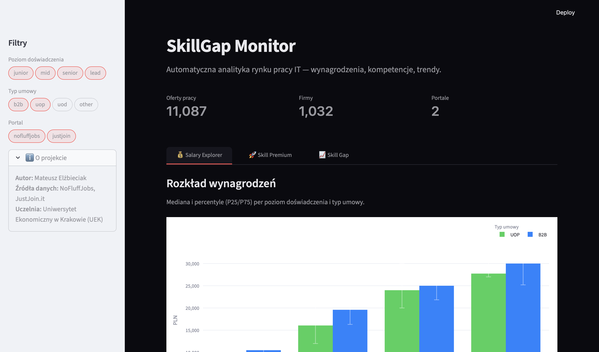
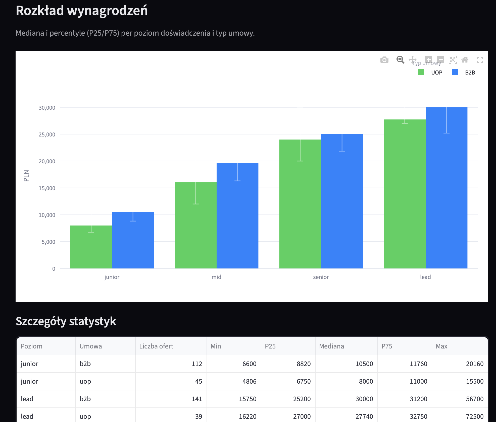
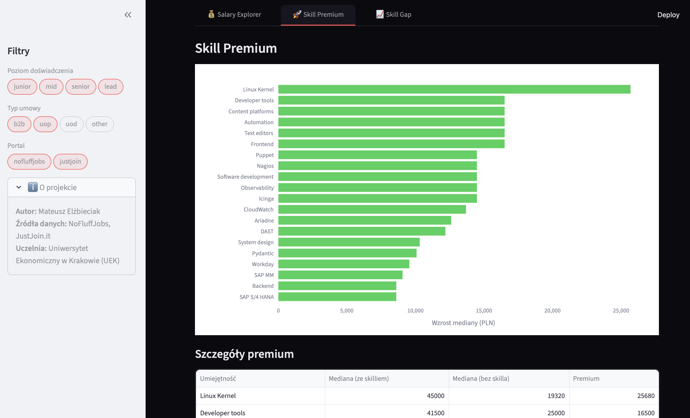
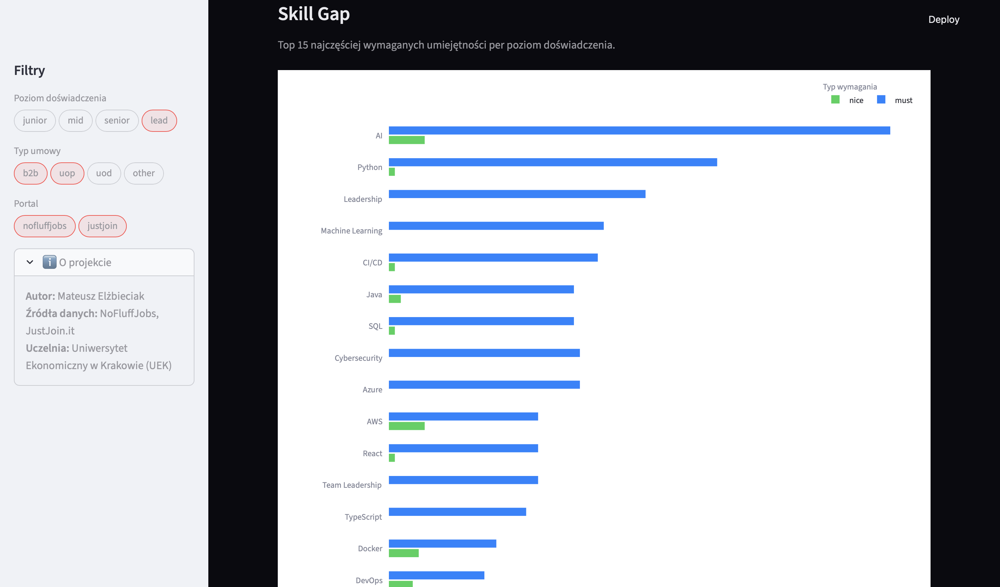

# SkillGap Monitor


**Automatyczny system analityki rynku pracy IT w Polsce — wynagrodzenia, kompetencje, luki technologiczne.**

---

## 📖 O projekcie

SkillGap Monitor to system Data Engineering automatycznie pozyskujący oferty pracy IT z portali NoFluffJobs i JustJoin.it poprzez reverse-engineered API JSON. Zebrane dane trafiają przez walidujące pipeline'y do znormalizowanej bazy PostgreSQL, skąd Streamlit Dashboard prezentuje trzy wymiary analityczne: mediany wynagrodzeń, wpływ konkretnych skilli na zarobki (Skill Premium) oraz ranking najczęściej wymaganych kompetencji (Skill Gap).

Wartość biznesowa systemu koncentruje się na rynku HR i kandydatach: dział rekrutacji zyskuje benchmark płac z separacją B2B (netto) od UoP (brutto), eliminując przekłamania statystyczne. Analiza Skill Premium odpowiada na pytanie *„o ile PLN podnosi moje wynagrodzenie znajomość Kubernetes?"*, a Skill Gap wizualizuje ścieżkę kariery junior→senior przez pryzmat wymagań rzeczywistego rynku — nie ogólnych poradników.

Projekt zrealizowany w ramach studiów na kierunku Informatyka Stosowana na Uniwersytecie Ekonomicznym w Krakowie (indeks: 233651) i stanowi flagowy element portfolio Junior Python Developer / Data Engineer — demonstrując umiejętności w zakresie web scrapingu, inżynierii danych, modelowania relacyjnych baz danych i wizualizacji analitycznej.

---

## 📸 Dashboard





> Dashboard analityczny z trzema zakładkami: Salary Explorer, Skill Premium, Skill Gap.

---

## 🏗️ Architektura systemu

```
┌─────────────────────┐    ┌─────────────────────┐
│  NoFluffJobs API    │    │   JustJoin.it API   │
│  (POST lista +      │    │  (GET candidate-api │
│   GET szczegóły)    │    │   /offers, offset)  │
└────────┬────────────┘    └──────────┬──────────┘
         │                            │
         └──────────┬─────────────────┘
                    ▼
         ┌─────────────────────┐
         │   Scrapy Spiders    │
         │  DOWNLOAD_DELAY=2.5 │
         │  AutoThrottle ON    │
         └──────────┬──────────┘
                    ▼
         ┌─────────────────────┐
         │  ValidationPipeline │
         │  (salary, HTML,     │
         │   normalizacja)     │
         └──────────┬──────────┘
                    ▼
         ┌─────────────────────┐
         │  PostgresPipeline   │
         │  (UPSERT + Soft     │
         │   Delete + dedup)   │
         └──────────┬──────────┘
                    ▼
         ┌─────────────────────┐
         │  Supabase           │
         │  (PostgreSQL 15)    │
         │  4 tabele, 3NF      │
         └──────────┬──────────┘
                    ▼
         ┌─────────────────────┐
         │ Streamlit Dashboard │
         │ 3 zakładki analityk.│
         └─────────────────────┘
```

**Warstwa ekstrakcji (Scrapy):** Dwa pająki pobierają dane wyłącznie z nieudokumentowanych endpointów JSON (Fetch/XHR — bez parsowania HTML). Spider NoFluffJobs stosuje architekturę dwustopniową: POST na endpoint listy ofert z paginacją per-technologia, następnie GET szczegółów każdej oferty po ID (pełne `requirements`). Spider JustJoin.it to jednokrokowy GET z paginacją offsetową. Oba działają z `DOWNLOAD_DELAY=2.5` i AutoThrottle w celu przestrzegania zasad Polite Scraping.

**Warstwa przetwarzania (Pipelines):** `ValidationPipeline` (priority 100) waliduje wynagrodzenia przez scentralizowany moduł z progami rynkowymi (B2B min 6 000 PLN/mies., stawka godzinowa 20–500 PLN), normalizuje `experience_level` i `contract_type`, usuwa tagi HTML z pól tekstowych. `PostgresPipeline` (priority 200) zapisuje dane przez UPSERT (`ON CONFLICT DO UPDATE`), stosuje Soft Delete (`is_active = FALSE`) zamiast fizycznego usuwania rekordów oraz deduplikuje po kluczu `(source_portal, external_id)`.

**Warstwa danych (PostgreSQL / Supabase):** Cztery tabele w 3NF: `companies`, `job_offers` (z `salary_period`, `contract_type`, `is_active`), `offer_skills` (z `requirement_type`: must/nice), `skill_taxonomy` (z `standardized_name` dla normalizacji skilli). Rola `ai_read_only` z uprawnieniami wyłącznie `SELECT` przygotowana pod przyszły moduł Text-to-SQL.

**Warstwa prezentacji (Streamlit):** Dashboard z ciemnym motywem (dark theme inspirowany Apple) i trzema zakładkami analitycznymi. Globalne filtry (portal, poziom doświadczenia, typ umowy) aplikowane przez `@st.cache_data` z TTL 5 min.

---

## 🛠️ Stack

| Warstwa           | Technologia         | Wersja   |
|-------------------|---------------------|----------|
| Język             | Python              | 3.13     |
| Menedżer pakietów | uv (Astral)         | latest   |
| Scraping          | Scrapy              | 2.16     |
| Baza danych       | PostgreSQL (Supabase)| 15      |
| Dashboard         | Streamlit           | 1.57     |
| Sterownik DB      | psycopg2            | latest   |
| Zmienne środow.   | python-dotenv       | latest   |

---

## 📊 Źródła danych

| Portal        | Metoda scrapingu                                             |
|---------------|--------------------------------------------------------------|
| NoFluffJobs   | Dwustopniowy: POST lista (paginacja per-technologia) + GET szczegóły — reverse engineering przez DevTools |
| JustJoin.it   | Jednokrokowy GET candidate-api `/offers` z paginacją offsetową |

Łącznie ~10 000+ aktywnych ofert IT z Polski. Zakres technologii: Python, Java, JavaScript, TypeScript, C#, Go, Rust, Kotlin, Scala, React, Angular, Docker, Kubernetes, AWS i inne.

Dane pochodzą z publicznych portali pracy i są wykorzystywane wyłącznie do celów analitycznych i edukacyjnych.

---

## 📈 Funkcje analityczne

### Salary Explorer

Mediana wynagrodzeń (PLN) z przedziałem P25–P75 per poziom doświadczenia (junior/mid/senior/lead) i typ umowy (B2B/UoP/UoD). Mediana zamiast średniej arytmetycznej eliminuje wpływ outlierów — kilka ofert z wynagrodzeniem 5× rynkowym nie przekłamuje obrazu. Globalne filtry pozwalają zawęzić analizę do konkretnego portalu, poziomu lub rodzaju kontraktu.

### Skill Premium

Mierzy wpływ konkretnej umiejętności na medianę wynagrodzenia metodą **within-level**: porównanie mediany ofert *z* danym skillem vs. mediany ofert *bez* niego — w obrębie tego samego poziomu doświadczenia. Kontrola za poziom doświadczenia eliminuje najbardziej oczywistą zmienną zakłócającą (senior zarabia więcej i zna więcej technologii). Wynik: ranking skilli z informacją *„+X PLN / −X PLN do mediany"*.

### Skill Gap

Ranking 15 najczęściej wymaganych umiejętności per poziom doświadczenia z rozróżnieniem `must-have` (twarde wymagania) vs. `nice-to-have`. Wizualizuje, które kompetencje są obowiązkowe na poziomie junior, a które dopiero na senior — dając konkretną mapę drogową rozwoju kariery opartą o dane rynkowe.

---

## 🚀 Uruchomienie lokalne

### Wymagania

- Python 3.13+
- `uv` — menedżer pakietów: `pip install uv`
- Darmowe konto [Supabase](https://supabase.com) z bazą PostgreSQL

### Setup

**1. Sklonuj repozytorium**
```bash
git clone https://github.com/matix-elzbi/skillgap-monitor.git
cd skillgap-monitor
```

**2. Zainstaluj zależności**
```bash
uv sync
```

**3. Skonfiguruj zmienne środowiskowe**
```bash
cp .env.example .env
# Uzupełnij DATABASE_URL w pliku .env (Transaction Pooler Supabase, port 6543)
```

**4. Zainicjalizuj schemat bazy danych**
```bash
uv run python scripts/init_db.py
```

**5. Uruchom scrapery**
```bash
cd scraper
uv run scrapy crawl justjoin -L INFO
uv run scrapy crawl nofluffjobs -L INFO
```

**6. Uruchom dashboard**
```bash
cd ..
uv run streamlit run app/main.py
```

---

## 📁 Struktura projektu

```
skillgap_scraper/
├── app/
│   └── main.py                          # Streamlit dashboard (3 zakładki analityczne)
├── scraper/
│   └── scraper/
│       ├── spiders/
│       │   ├── nofluffjobs.py           # Spider dwustopniowy (POST lista + GET szczegóły)
│       │   └── justjoin.py              # Spider JustJoin.it (jednokrokowy GET)
│       ├── items.py                     # Wspólny JobOfferItem dla wszystkich portali
│       ├── pipelines.py                 # ValidationPipeline + PostgresPipeline
│       └── settings.py                  # Polite Scraping (delay, autothrottle)
├── migrations/
│   ├── 001_normalize_skill_taxonomy.sql
│   ├── 002_*.sql
│   ├── 003_*.sql
│   └── 004_clean_all_salary_bugs.sql
├── docs/                                # Dokumentacja projektowa (PRD, WBS, STATUS)
├── scripts/
│   ├── init_db.py                       # DDL — inicjalizacja schematu bazy
│   └── bootstrap_skills.py             # Seed początkowego słownika skill_taxonomy
├── .env                                 # Zmienne środowiskowe — NIE commitować
├── .env.example                         # Szablon .env
├── pyproject.toml                       # Zależności projektu (uv)
└── README.md
```

---

## ⚠️ Znane ograniczenia

- **Normalizacja taksonomii skilli** jest częściowa — mapowanie `raw_name → standardized_name` pokrywa główne aliasy (np. "Postgres" → "PostgreSQL"), ale long-tail technologii z ofert pozostaje nienormalizowany. Pełna normalizacja to Future Work.
- **Skill Premium** metodą within-level kontroluje poziom doświadczenia jako zmienną zakłócającą, ale nie kontroluje innych czynników (branża, wielkość firmy, lokalizacja). Interpretacja wyników powinna uwzględniać ten kontekst.
- **Próbka ~10 000 ofert** stanowi reprezentatywny przekrój rynku IT w Polsce, ale nie jest pełną populacją. Portale nie udostępniają historycznych danych — snapshot odzwierciedla stan rynku w momencie scrapingu.

---

## 🔮 Future Work

- **Trzeci portal — Bulldogjob:** spider jednokrokowy, mapowanie do wspólnego `JobOfferItem`
- **Moduł AI Text-to-SQL (BYOK):** zapytania w języku naturalnym tłumaczone na SQL przez LLM, wykonywane wyłącznie przez rolę `ai_read_only` (brak uprawnień zapisu)
- **Scheduled scraping:** automatyczne odświeżanie danych przez AWS EventBridge lub GitHub Actions (cron), Soft Delete ofert niewidzianych >48h
- **Wdrożenie chmurowe:** AWS EC2 + RDS lub Supabase + Railway dla Streamlit
- **Testy jednostkowe:** pytest dla `ValidationPipeline._validate_salary` (przypadki brzegowe: odwrócone widełki, nieobsługiwany period, wartości ujemne)

---

## 👤 Autor

**Mateusz Elżbieciak**
Informatyka Stosowana, Uniwersytet Ekonomiczny w Krakowie (UEK)
Indeks: 233651

*Projekt akademicki + element portfolio. Dane pochodzą z publicznych portali pracy i są wykorzystywane wyłącznie do celów analitycznych.*
